<div align="center">

# 🛣️ Road Damage Detection System

### A Smart AI-Powered Web App that Automatically Finds and Classifies Road Damage

**Built by Srusti · USN: 1NT23AD052 · NMIT Bangalore**

Guided by **Prof. Debarshi Mazumder** (ANN & Deep Learning) and **Prof. Palanivel R** (DIP & Computer Vision)

---

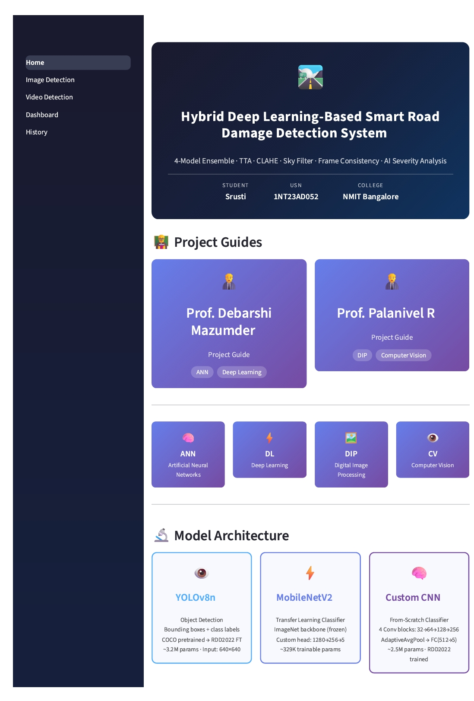
*The home page of the Road Damage Detection web application*

</div>

---

## 📖 What Is This Project?

Imagine you are driving on a road and you want to know — *"Is this road damaged? How bad is it? What should be done to fix it?"*

This project answers all of that **automatically using Artificial Intelligence (AI)**.

You simply upload a **photo or a video** of a road, and the system will:

- 🔍 **Find** all the damaged areas in the image
- 🏷️ **Label** what type of damage it is (crack, pothole, etc.)
- 🚦 **Rate** how serious the damage is (Minor / Moderate / Severe)
- 💰 **Estimate** the repair cost in Indian Rupees (₹)
- 🔧 **Suggest** what action should be taken to fix it
- 📄 **Generate** a professional PDF or CSV report
- 📧 **Email** the report directly to a road engineer

This is useful for **government road departments, municipal corporations, and civil engineers** who need to inspect roads quickly and efficiently.

---

## 🖼️ App Screenshots

### 🏠 Home Page
.jpeg)
*The home page shows project details, model information, and live session statistics*

### 🖼️ Image Detection
| Upload & Detect | Detection Output |
|---|---|
| 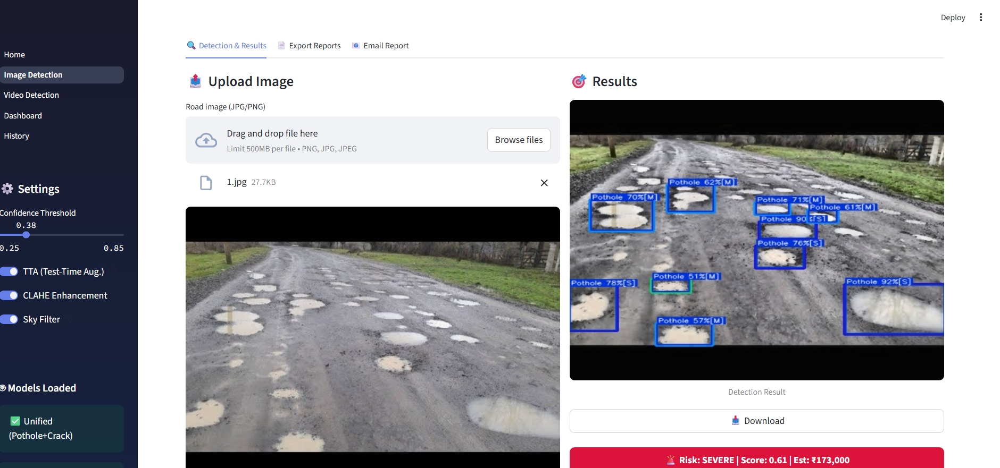 | 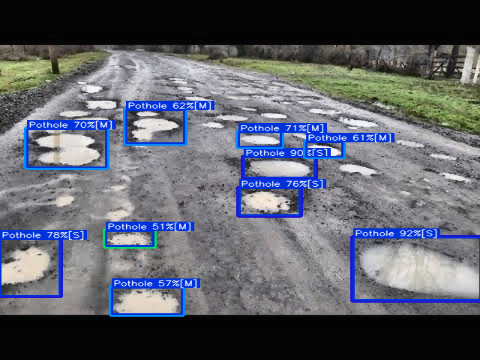 |

*Left: Upload a road photo and click "Run Detection". Right: The AI draws colored boxes around every damaged area it finds, with labels and confidence scores*

### 🎥 Video Detection
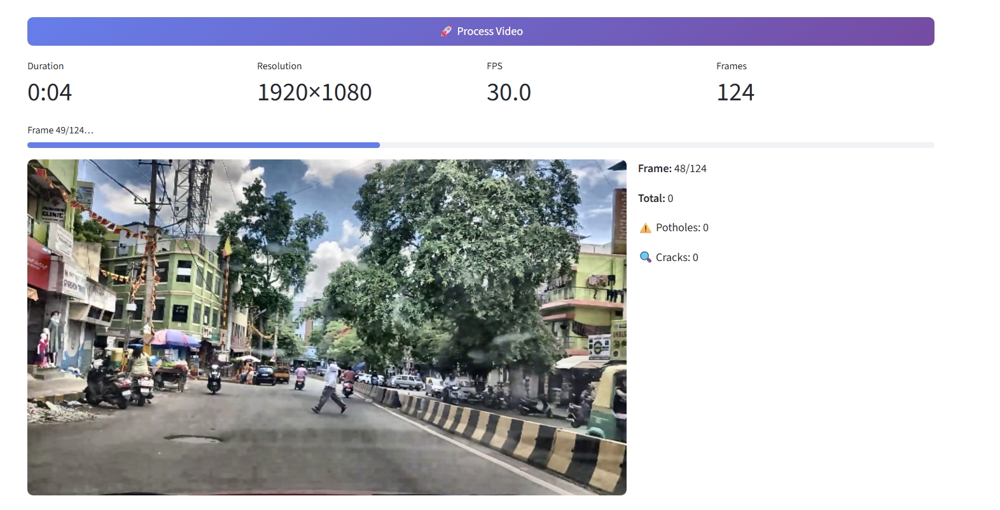
*Upload a road video and the system processes it frame by frame, detecting damage throughout the entire video*

### 📊 Analytics Dashboard
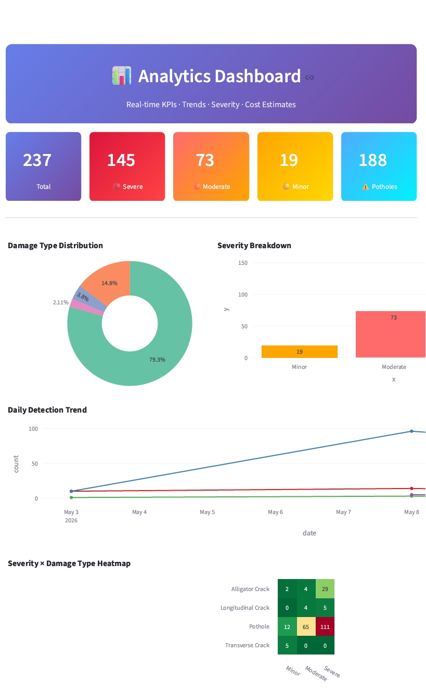
*The dashboard shows charts and statistics about all the detections made — damage types, severity breakdown, trends over time, and cost estimates*

### 🕐 Detection History
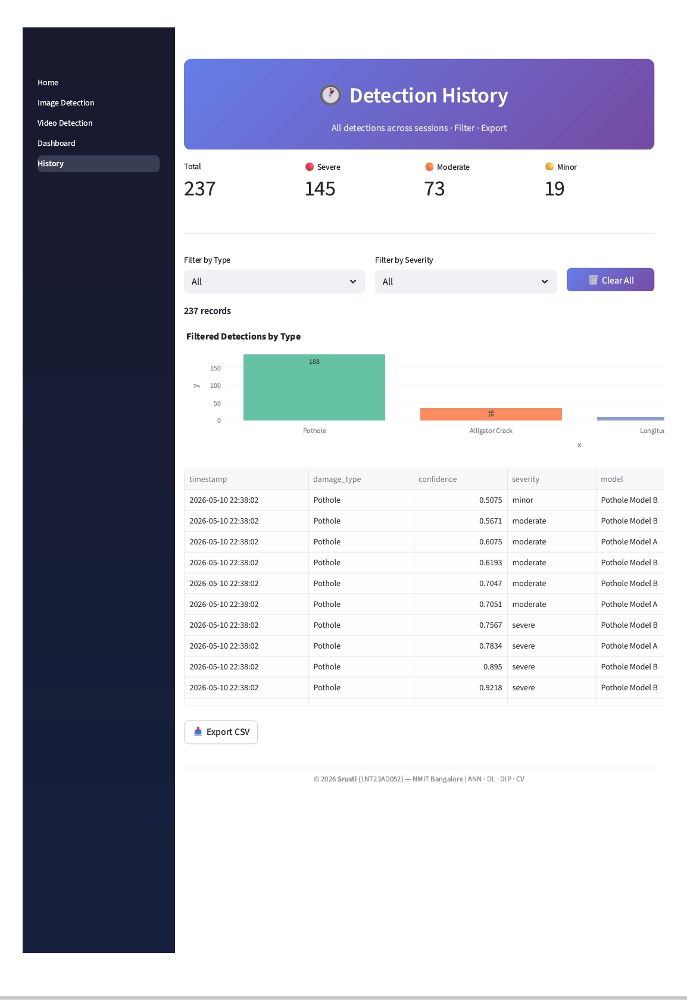
*Every detection is automatically saved. You can filter, search, and export the full history as a CSV file*

---

## 🤔 Why Does This Project Exist?

Road damage is a **serious problem** in India and around the world:

- Potholes and cracks cause **accidents and vehicle damage**
- Manual road inspection is **slow, expensive, and inconsistent**
- Damage often goes **unnoticed for months** before it is repaired
- There is no easy way to **prioritize** which roads need urgent repair

This project solves all of these problems by using AI to **automatically detect, classify, and prioritize** road damage from photos and videos — saving time, money, and potentially lives.

---

## 🧠 How Does the AI Work? (Simple Explanation)

Think of the AI like a **very well-trained human inspector** who has looked at thousands of road photos and learned to recognize damage patterns.

The system uses **3 AI models** working together:

### 👁️ Model 1 — YOLOv8n (The Detective)
> **What it does:** Looks at the entire image and draws boxes around damaged areas

- YOLO stands for **"You Only Look Once"** — it scans the whole image in one go
- It was first trained on millions of general images (called **COCO dataset**), then re-trained specifically on road damage photos
- It outputs: *"There is a pothole at this location, and I am 87% sure"*
- Input image size: 640×640 pixels

### ⚡ Model 2 — MobileNetV2 (The Expert with Experience)
> **What it does:** Classifies what type of damage is present in the image

- This model was originally trained by Google on **1.2 million images** from the internet (called **ImageNet**)
- We kept all that knowledge (called **Transfer Learning** — like hiring an expert who already knows a lot) and just taught it the road damage part
- Only the final decision-making layer was retrained — this saves time and works better with less data
- ~329,000 trainable parameters (think of parameters as the "brain cells" of the AI)

### 🧠 Model 3 — Custom CNN (The Specialist Built from Scratch)
> **What it does:** Also classifies damage type, but learned everything from road images only


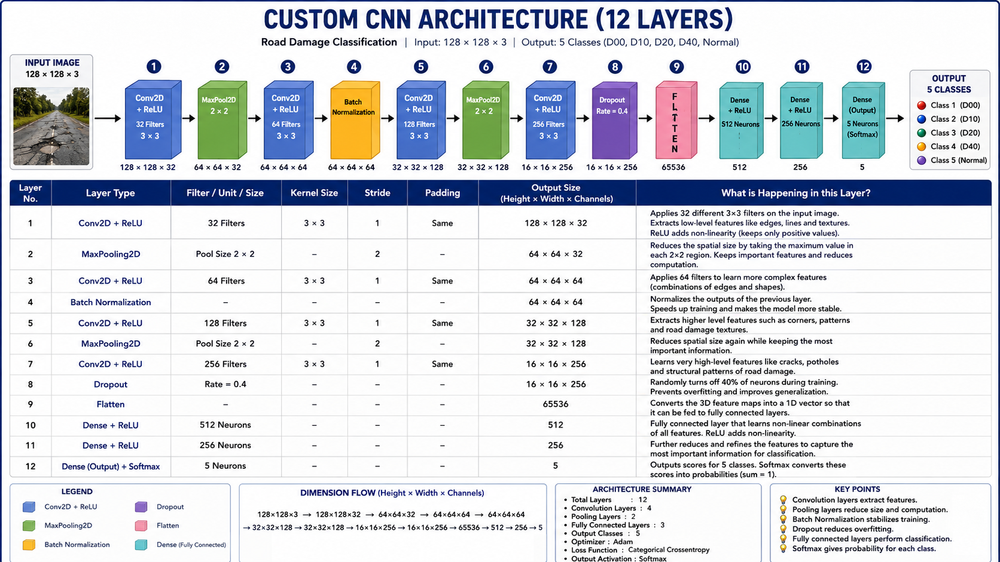

- CNN stands for **Convolutional Neural Network** — a type of AI specifically designed for images
- This model was built and trained entirely from scratch using only road damage photos
- It has 4 layers that progressively zoom in on features: edges → textures → patterns → damage types
- ~2.5 million parameters, all trained from zero

---

## 🔬 What Types of Damage Can It Detect?

| Damage Type | Code | What It Looks Like | Risk Level |
|---|---|---|---|
| 🕸️ Alligator Crack | D20 | A web of cracks that looks like alligator skin | High |
| ➖ Transverse Crack | D10 | A crack going across the road (left to right) | Medium |
| 〰️ Longitudinal Crack | D00 | A crack going along the road (front to back) | Low–Medium |
| ⚠️ Pothole | D40 | A hole or depression in the road surface | High–Critical |
| ✅ Normal | — | No damage detected | None |

---

## ⚙️ How the Detection Pipeline Works (Step by Step)

When you upload an image, here is exactly what happens behind the scenes:

```
📸 You upload a road photo
        ↓
🔧 Step 1 — CLAHE Enhancement
   The image is automatically brightened and sharpened
   (CLAHE = Contrast Limited Adaptive Histogram Equalization)
   This helps the AI see damage in dark or overexposed photos
        ↓
🤖 Step 2 — 3 AI Models Run Simultaneously
   YOLOv8n scans for damage locations
   MobileNetV2 classifies the damage type
   Custom CNN also classifies the damage type
        ↓
🔀 Step 3 — NMS (Non-Maximum Suppression)
   If multiple models detected the same damage spot,
   duplicate boxes are removed and only the best one is kept
        ↓
🌤️ Step 4 — Sky Filter
   Any detection in the top 25% of the image is removed
   (The sky cannot have road damage — this removes false alarms)
        ↓
📊 Step 5 — Severity Scoring
   Each detection gets a severity score based on:
   - How confident the AI is (confidence score)
   - How large the damaged area is (size of the box)
   - What type of damage it is (potholes are more dangerous)
        ↓
💰 Step 6 — Cost & Action Estimation
   Based on severity and damage type, the system estimates:
   - Repair cost in ₹
   - What repair action is needed
   - How urgently it needs to be fixed
        ↓
🎨 Step 7 — Annotated Output
   Colored boxes are drawn on the image with labels
   The result is shown on screen and can be downloaded
```

---

## 🎥 How Video Detection Works

For videos, the process is the same as images but with extra steps:

- The video is split into individual **frames** (like photos taken very fast)
- Every few frames are analyzed (you can control this with "Frame Skip")
- A **Frame Consistency Filter** ensures a detection is only shown if it appears in at least 2 consecutive frames — this removes flickering false alarms
- All detections are saved with their **timestamp** (what second in the video they appeared)
- The processed video with boxes drawn is saved and can be downloaded

---

## 📊 Severity Levels Explained

| Level | Color | Meaning | Example Action | Urgency |
|---|---|---|---|---|
| 🟡 Minor | Yellow | Small damage, not immediately dangerous | Apply crack sealant | Low |
| 🟠 Moderate | Orange | Noticeable damage, needs attention soon | Crack filling + surface treatment | Medium–High |
| 🔴 Severe | Red | Dangerous damage, needs urgent repair | Full-depth reconstruction | Critical |

---

## 💰 Repair Cost Estimates (in ₹)

| Damage Type | Minor | Moderate | Severe |
|---|---|---|---|
| Pothole | ₹3,000 | ₹10,000 | ₹30,000 |
| Alligator Crack | ₹2,000 | ₹7,000 | ₹45,000 |
| Transverse Crack | ₹500 | ₹3,500 | ₹14,000 |
| Longitudinal Crack | ₹400 | ₹2,500 | ₹12,000 |

---

## 📁 Project Structure (What Each File Does)

```
RoadDamageDetection/
│
├── 🏠 Home.py                        ← The main page of the web app
│
├── 📄 pages/
│   ├── 2_Image_Detection.py          ← Upload a photo → get detection results
│   ├── 3_Video_Detection.py          ← Upload a video → frame-by-frame detection
│   ├── 4_Dashboard.py                ← Charts and statistics of all detections
│   └── 5_History.py                  ← Full log of every detection ever made
│
├── 🔧 utils/
│   ├── hybrid_pipeline.py            ← The brain: runs all 3 models and merges results
│   ├── common.py                     ← Shared tools: image enhancement, CSS styling
│   ├── history_manager.py            ← Saves and loads detection history (CSV file)
│   ├── report_generator.py           ← Creates professional PDF reports
│   └── email_reporter.py             ← Sends reports via Gmail
│
├── 🤖 models/
│   ├── unified_best.pt               ← Trained YOLOv8 model (Pothole + Crack)
│   ├── best.pt                       ← Pothole detection model
│   └── YOLOv8_Small_RDD.pt           ← Crack detection model (auto-downloaded)
│
├── 🖼️ outputs/                       ← Screenshots and sample outputs
│
├── 📓 v1/                            ← Research notebooks (how models were trained)
│   ├── notebooks/
│   │   ├── 01_dataset_preparation.ipynb   ← Download and prepare the dataset
│   │   ├── 02_model_implementation.ipynb  ← Build all 3 models
│   │   ├── 03_training_evaluation.ipynb   ← Train and measure accuracy
│   │   └── 04_final_demo.ipynb            ← End-to-end demo
│   └── src/
│       ├── models.py     ← MobileNetV2 and Custom CNN definitions
│       ├── dataset.py    ← How images are loaded and prepared for training
│       ├── train.py      ← The training loop
│       ├── evaluate.py   ← Measuring accuracy, precision, recall, F1
│       └── predict.py    ← Single image inference
│
└── 📋 requirements.txt               ← List of all Python packages needed
```

---

## 🗃️ Dataset Used for Training

The models were trained on **RDD2022 (Road Damage Dataset 2022)**:

- 📦 ~18,000 labeled road images
- 🌍 From 3 countries: Japan, India, Czech Republic
- 🏷️ Each image has bounding box labels for damage locations
- 🔗 Source: [github.com/sekilab/RoadDamageDetector](https://github.com/sekilab/RoadDamageDetector)

> **What is a labeled image?** It means a human expert looked at each photo and drew boxes around every damaged area, telling the AI exactly where the damage is and what type it is. The AI then learned from thousands of these examples.

---

## 🚀 How to Set Up and Run This Project

### What You Need First

- A computer with **Python 3.9 or newer** installed
- **Git** installed (to download the project)
- An internet connection (to download model weights the first time)

> **What is Python?** Python is a programming language. Think of it as the language this project is written in. You need it installed to run the code.

---

### Step 1 — Download the Project

Open your terminal (Command Prompt on Windows) and type:

```bash
git clone https://github.com/Srusti-26
/RoadDamageDetection.git
cd RoadDamageDetection
```

> **What is git clone?** It downloads a copy of the entire project from GitHub to your computer.

---

### Step 2 — Create a Virtual Environment (Recommended)

A virtual environment is like a **separate clean room** for this project's packages, so they don't mix with other Python projects on your computer.

```bash
python -m venv venv
```

Then activate it:

- **Windows:** `venv\Scripts\activate`
- **Mac/Linux:** `source venv/bin/activate`

You will see `(venv)` appear at the start of your terminal line — that means it worked.

---

### Step 3 — Install All Required Packages

```bash
pip install -r requirements.txt
```

> **What is pip install?** It automatically downloads and installs all the Python libraries (tools) this project needs. This may take a few minutes.

---

### Step 4 — Add the Model Weight Files

The AI models are stored as `.pt` files (PyTorch model files). Place them in the `models/` folder:

```
models/
├── unified_best.pt       ← Main detection model
├── best.pt               ← Pothole model
└── (YOLOv8_Small_RDD.pt is auto-downloaded on first run)
```

> **What is a .pt file?** It contains the "learned knowledge" of the AI — all the numbers (weights) the model learned during training. Without this file, the AI has no knowledge.

---

### Step 5 — Run the App

```bash
streamlit run Home.py
```

Your browser will automatically open at `http://localhost:8501` and you will see the app!

> **What is Streamlit?** Streamlit is a Python tool that turns Python code into a web application automatically — no web development knowledge needed.

---

## 📱 How to Use the App

### 🖼️ Detecting Damage in an Image

1. Click **"Image Detection"** in the sidebar or on the home page
2. Click **"Browse files"** and select a road photo (JPG or PNG)
3. Adjust the **Confidence Threshold** slider if needed (higher = stricter, fewer detections)
4. Click **"🚀 Run Detection"**
5. Wait a few seconds — the AI processes the image
6. See the results: annotated image, detection cards, severity, cost estimate
7. Download the result as an image, PDF report, or CSV

### 🎥 Detecting Damage in a Video

1. Click **"Video Detection"** in the sidebar
2. Upload a road video (MP4, AVI, or MOV)
3. Adjust **Frame Skip** (higher = faster processing, fewer frames analyzed)
4. Click **"🚀 Process Video"**
5. Watch the live progress bar as each frame is analyzed
6. Download the processed video with damage boxes drawn on it

### 📊 Viewing the Dashboard

- Click **"Dashboard"** to see charts of all your detections
- See damage type distribution, severity breakdown, daily trends
- All data updates automatically after each detection

### 🕐 Viewing History

- Click **"History"** to see every detection ever made
- Filter by damage type or severity
- Export the full history as a CSV file for further analysis

---

## ⚙️ Settings You Can Adjust

| Setting | What It Does | Default |
|---|---|---|
| Confidence Threshold | How sure the AI must be before reporting damage (0.25 = less strict, 0.85 = very strict) | 0.38 |
| CLAHE Enhancement | Automatically improves image brightness/contrast before detection | ON |
| Sky Filter | Ignores detections in the top 25% of the image (sky area) | ON |
| TTA (Test-Time Augmentation) | Runs detection on a flipped version of the image too, for better accuracy | ON |
| Frame Skip (Video) | Analyze every Nth frame (3 = analyze every 3rd frame) | 3 |
| Frame Consistency (Video) | Only show detections seen in N consecutive frames | 2 |

---

## 📄 Reports and Exports

### PDF Report
- Professional A4 document with your college/project header
- Includes the annotated image, full detection table, severity summary, cost estimates
- Generated using the `reportlab` Python library

### CSV Export
- Spreadsheet-compatible file with all detection data
- Columns: Damage Type, Model, Confidence, Severity, Urgency, Action, Cost

### Email Report
- Sends a formatted HTML email with detection summary
- Can attach the PDF report
- Requires a Gmail account with an **App Password** (not your regular password)
  - Generate one at: [myaccount.google.com/apppasswords](https://myaccount.google.com/apppasswords)

---

## 🔑 Key Technical Terms Explained Simply

| Term | Simple Explanation |
|---|---|
| **AI / Artificial Intelligence** | Computer programs that learn from examples and make decisions like humans |
| **Deep Learning** | A type of AI that uses many layers of math to learn complex patterns |
| **Neural Network** | An AI model inspired by how the human brain works — made of connected "neurons" |
| **CNN (Convolutional Neural Network)** | A neural network specially designed to understand images |
| **YOLO (You Only Look Once)** | A fast AI model that detects objects in images in a single pass |
| **Transfer Learning** | Using a model already trained on one task and adapting it for a new task |
| **Training** | The process of showing the AI thousands of examples so it learns patterns |
| **Confidence Score** | How sure the AI is about a detection (0% = not sure, 100% = very sure) |
| **Bounding Box** | The colored rectangle drawn around a detected damage area |
| **NMS (Non-Maximum Suppression)** | A technique to remove duplicate detection boxes, keeping only the best one |
| **CLAHE** | An image processing technique that improves contrast in dark/bright images |
| **Parameters** | The numbers inside an AI model that store its learned knowledge |
| **Dataset** | A large collection of labeled images used to train the AI |
| **Epoch** | One complete pass through all training images during training |
| **Precision** | Of all the damages the AI detected, how many were actually real? |
| **Recall** | Of all the real damages in the image, how many did the AI find? |
| **F1 Score** | A combined score of Precision and Recall (higher is better) |

---

## 📊 Training Results (v1 Research Notebooks)

The training notebooks in `v1/` show how the models were built and evaluated:

### MobileNetV2 Training Curves
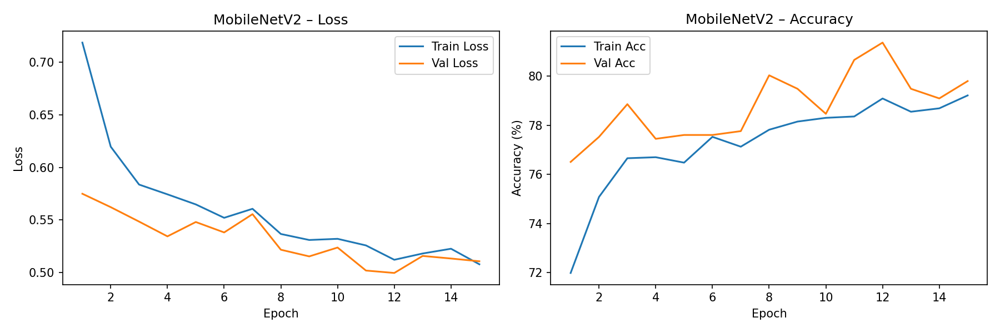
*Training and validation accuracy/loss curves for MobileNetV2 — shows how the model improved over each epoch*

### Dataset Class Distribution
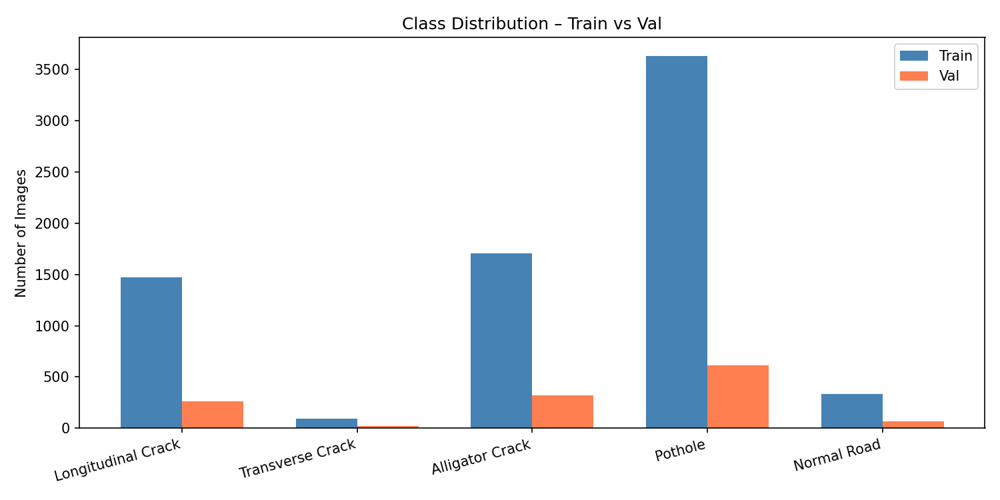
*How many images of each damage type are in the training dataset*

### Sample Training Images
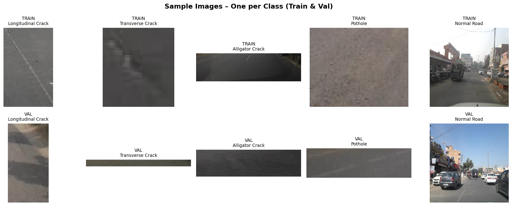
*Example road damage images from the RDD2022 dataset used for training*

### Prediction Confidence Distribution
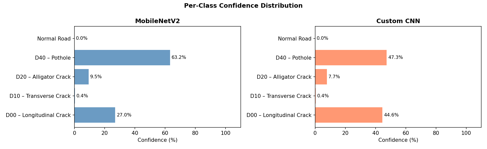
*Distribution of confidence scores on test images — higher scores mean the model is more certain*

---

## 📦 Python Packages Used

### For the Web App (`requirements.txt`)
| Package | What It Does |
|---|---|
| `streamlit` | Turns Python code into a web application |
| `ultralytics` | Provides the YOLOv8 detection model |
| `opencv-python` | Image and video processing (reading, resizing, drawing boxes) |
| `Pillow` | Opens and saves image files |
| `numpy` | Fast math operations on image arrays |
| `pandas` | Handles data tables (for history and reports) |
| `plotly` | Creates interactive charts for the dashboard |
| `reportlab` | Generates PDF reports |

### For Training (`v1/requirements.txt`)
| Package | What It Does |
|---|---|
| `torch` | The core deep learning framework (PyTorch) |
| `torchvision` | Pre-trained models and image tools for PyTorch |
| `scikit-learn` | Evaluation metrics (accuracy, F1, confusion matrix) |
| `matplotlib` / `seaborn` | Plotting training curves and charts |
| `tqdm` | Progress bars during training |

---

## 🗂️ File Descriptions (Every Important File)

| File | What It Does |
|---|---|
| `Home.py` | Main page — shows project info, model cards, session stats, navigation |
| `pages/2_Image_Detection.py` | Full image detection page with upload, results, reports, email |
| `pages/3_Video_Detection.py` | Full video detection page with frame processing and timeline charts |
| `pages/4_Dashboard.py` | Analytics dashboard with charts from detection history |
| `pages/5_History.py` | Detection history viewer with filters and CSV export |
| `utils/hybrid_pipeline.py` | Core detection logic — runs models, filters, merges, scores severity |
| `utils/common.py` | Shared utilities — CLAHE preprocessing, CSS styling, footer |
| `utils/history_manager.py` | Reads and writes detection history to `reports/history.csv` |
| `utils/report_generator.py` | Builds PDF reports using ReportLab |
| `utils/email_reporter.py` | Sends HTML + PDF reports via Gmail SMTP |
| `v1/src/models.py` | Defines MobileNetV2 and Custom CNN architectures in PyTorch |
| `v1/src/dataset.py` | Loads and preprocesses images for training |
| `v1/src/train.py` | Training loop with loss, optimizer, and metric tracking |
| `v1/src/evaluate.py` | Computes accuracy, precision, recall, F1, confusion matrix |
| `v1/src/predict.py` | Runs inference on a single image using trained models |

---

## ❓ Common Questions

**Q: The app says "model not found" — what do I do?**
> Make sure `models/unified_best.pt` and `models/best.pt` exist. The RDD crack model is downloaded automatically on first run (needs internet).

**Q: Detection is very slow — how do I speed it up?**
> Turn off TTA in the sidebar. For videos, increase the Frame Skip value. If you have a GPU (NVIDIA), PyTorch will use it automatically.

**Q: The confidence threshold — what should I set it to?**
> Start with 0.38 (default). If you see too many false detections, increase it. If the AI is missing obvious damage, decrease it.

**Q: Can I use this on my phone?**
> Yes! Since it runs in a browser, you can access it from any device on the same network by visiting `http://<your-computer-ip>:8501`.

**Q: How do I train the models myself?**
> Open the notebooks in `v1/notebooks/` in order: 01 → 02 → 03 → 04. Each notebook has step-by-step instructions.

---

## 👩‍💻 About the Developer

| | |
|---|---|
| **Name** | Srusti |
| **USN** | 1NT23AD052 |
| **College** | Nitte Meenakshi Institute of Technology (NMIT), Bangalore |
| **Department** | Artificial Intelligence & Data Science |
| **Project Guide 1** | Prof. Debarshi Mazumder — ANN & Deep Learning |
| **Project Guide 2** | Prof. Palanivel R — Digital Image Processing & Computer Vision |

---

## 📜 License & Credits

- This project is built for **educational and research purposes**
- Dataset: [RDD2022 by Sekilab](https://github.com/sekilab/RoadDamageDetector) — used under research license
- YOLOv8 by [Ultralytics](https://github.com/ultralytics/ultralytics)
- MobileNetV2 pretrained weights from [PyTorch/torchvision](https://pytorch.org/vision/stable/models.html)

---

<div align="center">

© 2026 Srusti (1NT23AD052) — NMIT Bangalore

*ANN · Deep Learning · Digital Image Processing · Computer Vision*

</div>
